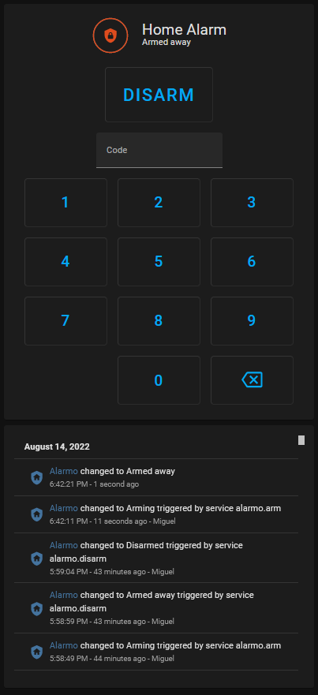

# HA Alarmo
My Alarm Home Project

Add to Home Assistant:

# HACS:

Integration Alarmo for Home Assistant:
https://github.com/nielsfaber/alarmo

Lovelace Alarmo Card for Home Assistant:
https://github.com/nielsfaber/alarmo-card



# alarmo-sensors.yaml

``` yaml
esphome:
  name: alarmo-sensors

esp32:
  board: esp32dev
  framework:
    type: arduino

# Enable logging
logger:

# Enable Home Assistant API
api:
  password: !secret api.ota_password

ota:
  password: !secret api.ota_password

wifi:
  ssid: !secret wifi_ssid
  password: !secret wifi_password

  # Enable fallback hotspot (captive portal) in case wifi connection fails
  ap:
    ssid: "Alarmo Fallback Hotspot"
    password: !secret ap_password

captive_portal:
#################################
# ESPHome Alarm / Miguel Renato #
#################################
web_server:
  port: 2222
  auth:
    username: !secret username
    password: !secret password
#Sensor type PIR / Zones
binary_sensor:
  - platform: gpio
    name: "Zone 1"
    device_class: motion
    pin:
      number: GPIO16
      mode: INPUT_PULLDOWN
#---------------------------
  - platform: gpio
    name: "Zone 2"
    device_class: motion
    pin:
      number: GPIO17
      mode: INPUT_PULLDOWN
#---------------------------
  - platform: gpio
    name: "Zone 3"
    device_class: motion
    pin:
      number: GPIO18
      mode: INPUT_PULLDOWN
#---------------------------
  - platform: gpio
    name: "Zone 4"
    device_class: motion
    pin:
      number: GPIO19
      mode: INPUT_PULLDOWN
#---------------------------
  - platform: gpio
    name: "Zone 5"
    device_class: motion
    pin:
      number: GPIO21
      mode: INPUT_PULLDOWN
#---------------------------
  - platform: gpio
    name: "Zone 6"
    device_class: motion
    pin:
      number: GPIO22
      mode: INPUT_PULLDOWN
#---------------------------
  - platform: gpio
    name: "Zone 7"
    device_class: motion
    pin:
      number: GPIO23
      mode: INPUT_PULLDOWN
#---------------------------
  - platform: gpio
    name: "Zone 8"
    device_class: motion
    pin:
      number: GPIO25
      mode: INPUT_PULLDOWN
#---------------------------
  - platform: gpio
    name: "Alarm Tamper"
    device_class: door
    pin:
      number: GPIO26
      mode: INPUT_PULLDOWN
#---------------------------
# Outdoor Siren
switch: 
  - platform: gpio
    name: Outdoor Siren/strobe
    pin: GPIO27
#---------------------------
# Piezo-> 1 long beep and 3 times beep
  - platform: gpio
    pin: GPIO32
    inverted: yes
    id: beep
  - platform: template
    name: Beep
    turn_on_action:
      - switch.turn_on: beep
      - delay: 60ms
      - switch.turn_off: beep
      - delay: 60ms
      - switch.turn_on: beep
      - delay: 60ms
      - switch.turn_off: beep
      - delay: 60ms
      - switch.turn_on: beep
      - delay: 60ms
      - switch.turn_off: beep
  - platform: template
    name: Buzzer
    turn_on_action:
      - switch.turn_on: beep
      - delay: 600ms
      - switch.turn_off: beep
```
